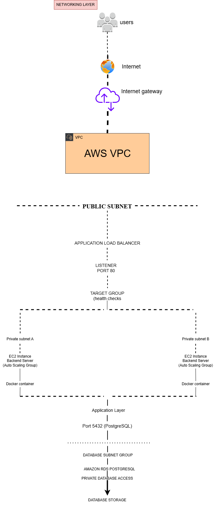

# AWS 3-Tier Infrastructure Deployment Using Terraform

## Introduction

This project is a result of my journey learning Cloud and DevOps Engineering. I wanted to move beyond deploying a single EC2 instance and build something that resembles how modern applications are deployed in production environments.

Rather than manually creating AWS resources, I used Terraform to provision and manage the infrastructure. Throughout this project, I learned how different AWS services work together and gained practical experience troubleshooting real deployment issues.

The project implements a 3-tier architecture consisting of:

* A networking layer built with Amazon VPC.
* An application layer using EC2 instances, Docker containers, and Auto Scaling.
* A database layer using Amazon RDS PostgreSQL.
* A CI/CD pipeline using Jenkins.
* Amazon ECR for storing Docker images.
* AWS Secrets Manager for managing sensitive information.
* IAM roles and policies for secure access management.

One of my goals while building this project was to understand not only how to deploy resources, but also why they are deployed in a particular way. For example, I chose to place backend resources inside private subnets to improve security and used Terraform's `plan` command extensively before applying changes to avoid unnecessary AWS charges during development.

---

## Why I Built This Project

I built this project to gain practical experience with:

* Infrastructure as Code (Terraform)
* AWS networking concepts
* CI/CD pipelines
* Cloud security best practices
* Containerization using Docker
* Cost optimization strategies in AWS
* Cloud architecture design

More importantly, I wanted to understand how individual services communicate with one another. Before starting this project, services like Auto Scaling Groups, Load Balancers, IAM Roles, and RDS existed as separate concepts to me. Building this infrastructure helped me understand how they fit together to deliver a scalable and secure application.

---

## Project Architecture

The infrastructure follows a 3-tier architecture model consisting of:

1. Presentation Layer
2. Application Layer
3. Database Layer

---
## Networking Architecture

One of the areas I spent the most time understanding during this project was AWS networking. Before building the infrastructure, concepts such as VPCs, subnets, route tables, and gateways felt like individual services. Implementing them together helped me understand how traffic moves securely through a cloud environment.

The networking layer was designed to provide:

* Security
* Scalability
* Controlled internet access
* High availability

### Virtual Private Cloud (VPC)

The VPC acts as the foundation of the entire infrastructure. It provides an isolated networking environment where all AWS resources are deployed and managed securely.

### Public Subnets

Public subnets were created for resources that require internet access, such as:

* Application Load Balancer
* Jenkins Server

Resources deployed in public subnets are able to communicate with the internet through the Internet Gateway.

### Private Subnets

Private subnets were used to host backend resources, including:

* Backend EC2 instances
* Amazon RDS PostgreSQL

These resources do not require direct internet access, making them more secure. Access to backend resources is restricted to approved services such as the Application Load Balancer.

### Internet Gateway

The Internet Gateway enables communication between resources in public subnets and the internet. Without it, users would be unable to access internet-facing services deployed within the infrastructure.

### NAT Gateway

The NAT Gateway allows resources inside private subnets to access the internet when necessary without exposing them publicly. This is particularly useful when backend servers need to download packages, install updates, or communicate with AWS services securely.

### Route Tables

Route tables were configured to determine how network traffic flows between the different components of the infrastructure.

They are responsible for:

* Routing internet traffic.
* Managing communication between subnets.
* Controlling access to the Internet Gateway and NAT Gateway.

### Security Groups

Security Groups act as virtual firewalls for AWS resources. They were configured using the principle of least privilege by allowing only the required traffic.

Examples include:

* Allowing HTTP (Port 80) traffic to the Application Load Balancer.
* Restricting PostgreSQL (Port 5432) access to backend servers only.
* Restricting SSH access where necessary.
* Preventing direct public access to private resources.

### Networking Workflow



Building the networking layer helped me understand that cloud architecture is more than simply launching servers. Proper networking design plays an important role in securing applications, controlling traffic flow, and improving scalability and reliability across the infrastructure.

## What I Learned

This project taught me much more than simply writing Terraform code. Some of the concepts I learned include:

* Designing VPC architectures.
* Working with public and private subnets.
* Creating and managing Security Groups.
* Using Terraform variables securely.
* Managing Terraform state files.
* Creating IAM roles and instance profiles.
* Working with Amazon RDS PostgreSQL.
* Building Docker images.
* Creating Jenkins pipelines.
* Managing secrets securely.
* Troubleshooting Terraform deployment errors.
* Managing cloud infrastructure costs.

One of the biggest lessons I learned was the importance of planning infrastructure before deployment. Throughout development, I relied heavily on `terraform plan` to validate my configurations before creating AWS resources.

---

## Technologies Used

### Cloud Services

* Amazon Web Services (AWS)
* Amazon EC2
* Amazon RDS
* Amazon VPC
* Amazon ECR
* AWS Secrets Manager
* Application Load Balancer
* Auto Scaling Groups
* IAM

### DevOps Tools

* Terraform
* Jenkins
* Docker
* Git
* GitHub
* AWS CLI

### Operating Systems

* Ubuntu Linux
* Windows 11

---

## Cost Management

Since this project was built for learning purposes, cost management was an important consideration.

Some of the practices I followed include:

* Reviewing infrastructure changes using `terraform plan`.
* Avoiding unnecessary deployments during development.
* Destroying resources immediately after testing.
* Protecting sensitive information using `.gitignore`.
* Using free-tier compatible resources whenever possible.

After testing the infrastructure, resources are removed using:

```bash
terraform destroy
```

to avoid unnecessary AWS charges.

---

## Challenges I Encountered

This project wasn't built without challenges. Some of the issues I encountered include:

* Terraform state file problems.
* Git repository configuration issues.
* IAM permission errors.
* Reserved PostgreSQL database names in RDS.
* Terraform variable management.
* Managing sensitive information securely.
* Jenkins configuration challenges.
* AWS cost considerations during testing.

Troubleshooting these issues became one of the most valuable parts of the learning process and helped me gain a better understanding of how cloud infrastructure behaves in real-world environments.

---

## Future Improvements

Some of the improvements I plan to make include:

* Implementing HTTPS using SSL certificates.
* Adding Kubernetes deployments.
* Implementing Terraform remote state using Amazon S3.
* Adding CloudWatch monitoring and alerting.
* Integrating Prometheus and Grafana.
* Implementing Blue/Green deployment strategies.
* Adding automated testing stages to the Jenkins pipeline.

---

## Final Thoughts

This project represents my practical experience learning Cloud and DevOps Engineering. Beyond building the infrastructure itself, it reflects the time spent understanding AWS services, troubleshooting deployment problems, applying security best practices, and learning how modern cloud applications are designed and managed.

While the architecture can still be improved and expanded, it has provided me with valuable hands-on experience in Infrastructure as Code, cloud networking, automation, and CI/CD practices.

## Author

**Momohjimoh Mustapha**

Cloud | DevOps | AWS | Terraform Portfolio Project
